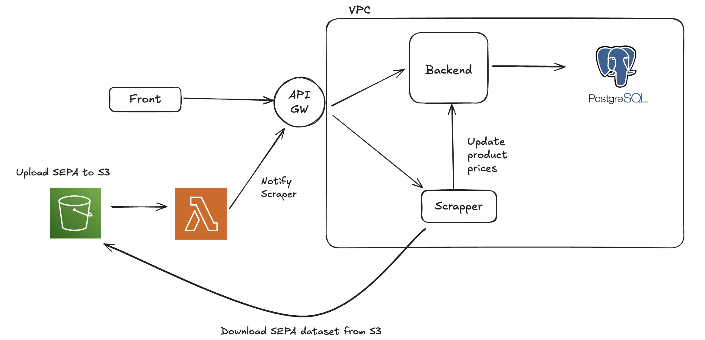

# Ahorratón

Ahorraton is a web application that compares product prices from the top Argentinian supermarkets and recommends the most cost-effective store based on a user’s shopping list.

# Architecture

# Front

Front end application. It connects to the API Gateway to query product, lists and user data. [Demo](https://front-five-plum.vercel.app/) deployed with Vercel.

Stack:

* React
* Next Framework
* Typescript
* REDUX for browser cache

# Gateway

This is the **only** public endpoint where requests are made to the backend and where we notify the scraper that SEPA datase has been uploaded to AWS S3.

Stack:

* FastAPI

# Backend + DB

This service performs all of the application internal logic needed for:
* Posting products into DB, querying products.
* Creating and authenticating users.
* Updating recipes and updating shopping lists.

> This is the only service with access to the PostgreSQL DB 

Stack:

* FastAPI
* Alembic + SQLalchemy ORM
* PostgreSQL
* JWT for user authentication
* Pytest

# Scraper

Scrapes online supermarkets as well as fetches data from [SEPA precios claros](https://datos.produccion.gob.ar/dataset/sepa-precios) dataset to complement product prices.

> SEPA precios claros dataset contains product prices for physical supermarket stores. This dataset is updated daily but it has some [caveats](#sepa-dataset-caveats).

After downloading the data, it's processed, cleaned, standardized, and sent to the backend.

Stack:

* FastAPI
* Selenium + BeautifulSoup
* AWS S3
* Numpy + Pandas

## Main reasons why the scraper could break

* Supermarket website UI changes, therefore the paths we're looking for are no longer valid.
* Supermarket website is down, so the scraper can't load the webpage.
* Most of the time, SEPA dataset is consistent. But from time to time they change how data is structured and when that happens the scraper fails.

## SEPA dataset caveats

SEPA datasets are downloaded from [SEPA precios claros](https://datos.produccion.gob.ar/dataset/sepa-precios) endpoint. When we deployed the scraper in Railway, we found out that the download kept failing; even in isolated Lambda Functions. This meant that either the IP ranges for Railway are blocked from SEPA precios claros or the dataset is geofenced.

To get around this, we have some possible solutions:

1. Use a proxy as our IP address.
2. Download the data from another endpoint.
3. Change cloud infrastructure to one which isn't blocked.

Given the fact that the scraper is the most expensive service to run, we decided to create a workflow where manually uploading the dataset into an AWS S3 bucket triggers the scraper to run and update all of the products.

Because AWS S3 is a global service, we're not going to have any IP ban ploblems and the scraper can keep working as is. We only changed the endpoint where it donwloads the dataset.

